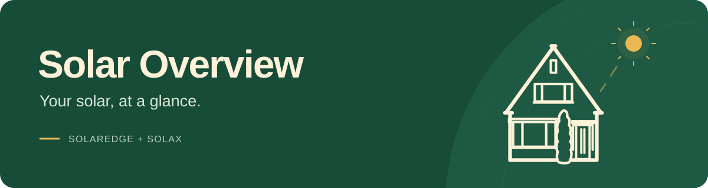

# 

A personal solar monitoring app for Android and iOS. It brings SolarEdge and
SolaX readings into one dashboard, with production, energy readings, source
details and combined solar power when fresh measurements align. Saved readings
and connection status make it clear when data is unavailable or out of date.

## Technology

- **App:** Flutter and Dart, with Material 3 widgets.
- **State management:** Flutter's built-in `ChangeNotifier` controllers and
  `ListenableBuilder`, with `setState` for local UI state.
- **API access:** The Dart `http` package connects directly to SolarEdge and SolaX.
- **Storage:** `flutter_secure_storage` keeps credentials and saved readings on
  the device.
- **Supporting tools:** Python scripts for API checks and icon generation;
  Flutter's testing tools and GitHub Actions for automated checks.

See [app/README.md](app/README.md) for app features, setup and development commands,
and [docs/](docs/) for integration notes.
